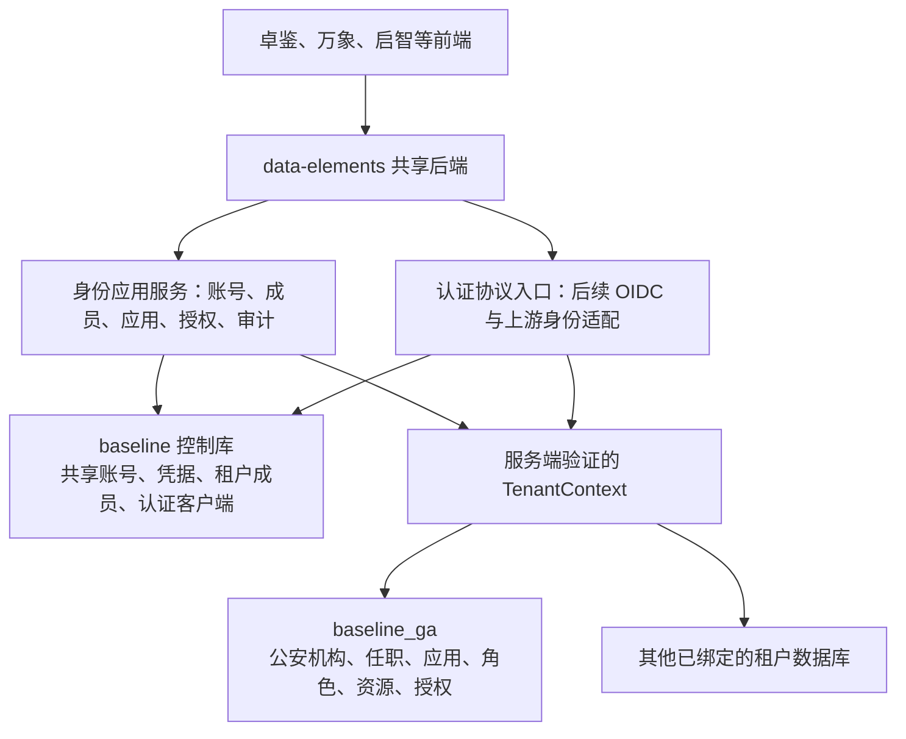

# 卓鉴统一身份管理平台：后端架构与数据库设计

英文工程：`data-elements-idaas`。共享后端：`data-elements`。

后续目标更新（2026-09-28）：用户明确控制库账号只登录卓鉴、租户库账号只登录租户系统，两套凭据、会话和权限隔离。下文的初次共享账号建议及 P1 实施补记保留为历史；最新目标与迁移顺序见 [第二阶段架构调整与落地计划](./第二阶段架构调整与落地计划.md)，该新方案尚未发布。

设计日期：2026-09-27。本文第 1—11 节保留初次只读分析及设计建议；后续第一阶段实际实现与库绑定见第 12 节及 [第一阶段后端实施说明](./backend-phase1-implementation.md)，不要将初次样本和候选接口当作当前发布事实。

本设计依据现有 Java 源码、控制库当前 `api_file_t` 中的 Magic 脚本、MySQL `baseline` / `baseline_ga` 的实际结构与只读统计，以及卓鉴需求规格、前端类型和授权计算规则。库中样本计数是本次核查时的快照，不代表生产规模。没有读取或导出个人身份字段、密码摘要、令牌或客户端密钥的实际值。

## 1. 推荐方案

继续使用一个 `data-elements` 后端，在既有 `feature.identity` 上增加卓鉴能力；沿用 `platform.tenant` 的租户上下文、数据源路由和控制库访问机制。

数据库沿用现有分工：**`baseline` 管共享账号、凭据、租户成员资格及认证入口；`baseline_ga` 管公安租户的机构、任职、应用接入、角色、资源、授权及业务审计。** 后续广电、海渔等租户采用相同逻辑结构和各自的数据源。无需把所有行业数据搬到控制库，也无需在每个租户库再复制账号密码表。

卓鉴前端提供新的管理入口，现有各中心继续调用同一套身份服务。新增 Java 接口和旧 Magic 接口最终调用共同的应用服务，避免两套账号或授权写入规则并存。



这里必须分开四个概念：

| 概念 | 公安例子 | 职责 |
| --- | --- | --- |
| 账号 `userId` | 控制库中的某个现有账号 ID | 标识登录主体；凭据只维护一份 |
| 租户 `tenantId` | `2084109831682699264`，公安行业场景 | 决定可访问哪个行业数据库 |
| 身份域 `domain` | `workforce` 政企、`public` 公众 | 同一租户内隔离不同身份及管理规则 |
| 应用 `appId` / 客户端 `clientId` | 数据治理中心、统一身份管理平台、某个浏览器客户端 | 应用决定角色资源范围；客户端决定认证协议、回调与令牌策略 |

切换系统只是导航；获得单点登录需要认证协议；切换租户需要有效成员资格；切换身份域也需要服务端验证。四者不能互相替代。

## 2. 实际数据库与运行逻辑

### 2.1 控制库

| 已有表 | 本次核查结果 | 推荐使用方式 |
| --- | --- | --- |
| `baseline.rm_user_t` | 43 条账号，36 条未删除；未删除记录的 `status` 都为 0 | 保留账号主表、现有 `id` 和旧凭据兼容能力 |
| `baseline.rm_user_tenant_rela_t` | 10 条有效成员关系，对应 6 个不同账号；公安 5 条、广电 2 条、海渔 1 条、澄天 2 条 | 表示账号能否进入某个租户；保留默认租户选择 |
| `baseline.sym_tenant_t` | 4 个有效行业场景 | 保留租户定义；物理连接绑定仍由后端配置管理 |
| `baseline.sym_config_t` | 运行配置和全局默认值 | 沿用 `SystemConfigService`，结合租户库覆盖配置 |
| `baseline.api_file_t`、`ui_component_t` | 当前 Magic 接口及低代码页面共享资源 | 继续放控制库；卓鉴 React 页面本身不要求搬入低代码表 |

当前账号状态的启停语义与成员关系不同：登录脚本将账号 `status=1` 视为禁用；成员关系和租户定义使用 `status=1` 表示有效。不能用一个通用的 `status == 1` 判断替代各实体的状态映射。

配置也不是“所有值都只在控制库”：`SystemConfigService` 读取全局默认配置，并通过 `TenantDataSourceRegistry` 访问选定租户库的覆盖值。后续身份配置应沿用这一机制，避免创建第二套互不一致的配置读取逻辑。

### 2.2 公安租户库

**当前 `baseline_ga` 不存在独立的 `rm_user_t` 账号主表。** 这里的“用户表”主要是任职、角色、网关访问等关系表。`flow_user` 是工作流参与者表，不能当成凭据主表。

| 已有表 | 当前记录数 | 推荐职责 |
| --- | ---: | --- |
| `rm_org_t` | 169 | 公安机构树，继续作为机构事实来源 |
| `rm_user_org_rela_t` | 36 | 账号在公安机构中的任职；不存登录密码 |
| `rm_role_t` | 3 | 应用下的角色定义 |
| `rm_menu_t` | 98 | 既有菜单与资源；补齐语义映射后复用 |
| `rm_role_menu_rela_t` | 98 | 角色与资源绑定 |
| `rm_user_role_rela_t` | 4 | 既有直接角色关系；后续作为兼容关系或有效授权投影 |
| `sym_application_t` | 1178 总记录，599 条未删除 | 已有业务应用台账；与认证接入登记建立关联 |
| `api_oauth_client_t` | 0 | 遗留 OAuth 配置结构；不能据此认定已有认证服务端 |
| `gateway_user_app_rela` | 2 | 网关特定的用户应用关系，保留其现有职责 |
| `log_user_login_t` | 4405 | 既有登录记录；新事件应使用脱敏、可关联的审计模型 |

上述组织、角色及用户关系数据均属于公安租户。`rm_org_t`、`rm_role_t`、`rm_menu_t` 和主要关系表的主键含 `tenant_id`，新表及查询也要维持这一边界。

`sym_application_t` 的 599 条未删除记录均未填写 `client_id` 和 `client_secret`。业务台账中的 `is_del`、资产登记状态和认证接入启用状态是不同含义，不能将这些应用全部自动注册为可登录客户端。

### 2.3 已有后端可以复用的部分

| 实现 | 现状及使用方式 |
| --- | --- |
| `ControlIdentityService` | 控制库账号查询、按租户成员资格过滤；可作为共享账号仓储入口 |
| `IdentityDirectoryServiceImpl` | 先查租户任职关系，再查控制库账号；已有跨库数据组装模式 |
| `IdentityAccountAdminService` | 控制库账号保存与成员分配；需拆开全局字段和租户字段的修改规则 |
| `IdentityTenantRelationService` | 保存租户机构关系；当前是单主职替换，需要扩展多任职 |
| `TenantAccessService` | 登录成员资格、可用租户、租户切换；沿用其成员验证能力 |
| `TenantContext` / `TenantRoutingDataSource` | 服务端上下文及行业库路由；新身份业务必须使用严格绑定验证 |
| `@UseControlDataSource` | 明确控制库服务边界；已有切面优先于事务开启 |
| Sa-Token / Redis | 当前平台登录会话基础；继续维护既有会话兼容 |
| Pingao 目录映射与 SSO 代码 | 上游身份源适配参考；现有 SSO 是接入上游，不是卓鉴向其他系统提供 OIDC 的服务端 |

当前后端为 Spring Boot 3.3.8、Java 21、Sa-Token 1.44.0、Magic API 2.2.2。现有 `pom.xml` 未配置独立的 OIDC 授权服务器框架。后续协议组件选型需要验证与这些版本、现有过滤链和租户路由的兼容性，不能直接照搬最新示例升级整个工程。

## 3. 第一阶段必须先解决的衔接问题

### 3.1 成员关系不足

36 个未删除账号中，30 个没有任何有效租户成员关系。公安 36 条任职关系中，有 31 条缺少对应的有效公安成员关系，涉及 29 个不同账号；这些任职关系的账号和机构本身都能找到。现有 4 条角色关系没有发现账号、角色或成员资格缺失。

这表示“控制库账号存在”和“公安库有任职记录”并不等于“账号当前允许进入公安租户”。目前不能直接把机构列表中所有人员当成可登录成员，也不能为控制库全部账号批量自动分配公安租户。

先生成按账号 ID 对账的迁移候选清单，区分在职人员、历史人员、停用人员和仅保留的全局账号；确认公安归属后，再幂等补齐成员关系。此步骤保留现有 ID，不重建用户。

### 3.2 现有角色应用与业务台账没有直接关联

现有 3 个角色均使用 `app_id=1995678661281710081`，在公安 `sym_application_t` 中没有对应的未删除记录。控制库和公安库本次也都没有实际的 `sym_platform_app_t` 表，虽然该名称出现在租户忽略表配置中。

因此先确认这个 ID 对应哪个平台运行应用。如果它是共享数据平台的管理应用，应登记为平台应用，保留原 ID；如果实际对应某条业务台账，应建立经确认的映射。不能把所有角色强行改绑到任意业务应用，也不能凭表名配置假设平台应用注册表已经存在。

### 3.3 角色与任职替换操作过宽

控制库当前 `/sym/user/saveRoles` 的脚本先按当前应用校验所选角色，再按 `user_id` 删除当前租户的全部角色关系。这样编辑一个应用时会影响其他应用角色，也不能保留机构、权限组等独立授权来源。

`/sym/role/saveOrUpdate` 也包含替换该角色全部用户关系的逻辑。卓鉴新增授权应调用按来源、应用、身份域限定范围的授权服务；迁移后的旧接口也要接入同一服务。

`IdentityTenantRelationService.saveOrganization` 当前删除一个用户全部机构关系，再写一个主职。卓鉴已有主职、兼职和多任职需求，需按任职 ID 更新或整体验证后保存任职集合，不能继续复用单关系覆盖。

### 3.4 移出租户不应自动删除共享账号

`ControlIdentityService.removeMembership` 在移除最后一个租户关系后会软删除 `rm_user_t`。卓鉴应将以下动作分开：移除某租户成员资格、停用某租户身份档案、停用全局账号、注销全局账号。

租户移除不自动触发账号注销。全局账号可能仍承担其他身份域登录、上游身份绑定或审计主体关联；注销须经独立规则检查。相关旧接口需要同步调整，避免形成两种注销语义。

### 3.5 登录上下文和资源编码还不能直接套用

现有 `/portal/login` 默认选择排序第一的有效租户，而不是账号自己的默认成员租户。新入口建议：注册客户端固定租户时使用该租户；管理登录显式选择则验证成员资格；没有指定时选择账号有效默认租户，多个候选且无默认则返回待选择状态。

当前登录把含密码字段的账号对象和请求 `appId` 写入账号级 Session。新实现只缓存最小身份信息，将租户、身份域、可信客户端、权限版本放入对应会话上下文；业务应用上下文不再由同账号的多个标签页共用一个可覆盖的 `appId` 字段。

既有 `/sym/user/me` 要求角色及公安主职机构、路径和根机构条件，不适合公众账号或首次接入的卓鉴账号。新增 `/idaas/session/me` 返回身份与可用能力；没有任职不等于身份查询失败，实际工作区入口再按对应能力校验。

公安现有未删除资源的 `resource_type` 为 0、2、3，而 `/sym/user/me` 中的权限 SQL 使用 `resource_type=1`。需要核对资源编辑器与消费者的真实枚举、`code` 和 `sno` 语义，建立显式映射；不能直接把前端的 `menu/button/api` 字符串写进旧数字字段。

### 3.6 路由与权限失效需要严格处理

`TenantDatabaseProperties.resolve` 对未绑定租户回退到默认公安数据源；`TenantAccessService` 存在缺失成员时自动绑定默认租户的兼容开关。`TenantWebInterceptor` 对已经有租户字段的 TokenSession 不会逐次重新验证成员资格。

新 `/idaas/**` 业务入口应做到：会话有效、账号有效、租户有效、成员有效、身份域有效、数据源明确绑定，任一不满足即拒绝访问。禁止新身份流程走自动绑定或未知租户回退；旧兼容行为逐步收敛，不在本设计阶段直接全局关闭。

现有角色读取检查角色启用，但没有检查关系的 `end_time`。新增授权计算要同时处理生效时间、到期时间和撤销版本；授权到期后不能依赖后台任务恰好执行才失效。

## 4. 数据所有权与模型

### 4.1 共享账号与租户身份档案

`rm_user_t.id` 继续作为现有账号主键。新前端和老关系仍使用该 ID；外部协议的 `sub` 另按发行者及身份域规则生成稳定标识，不用手机号、姓名或身份证号代替。

全局保存账号标识、验证凭据及明确共享的联系信息；租户库保存租户专属的工号、任职、条线、岗位、来源、租户启停状态等。现有 `rm_user_t` 已混入工号、职级、编制等字段，不能立即删列；先在租户档案中建立明确来源，旧接口做兼容读取，再按字段逐项迁移。

建议新增 `iam_user_profile_t`，唯一业务键为 `(tenant_id, domain, user_id)`，包含租户身份类型、租户状态、展示资料、扩展属性和版本。账号启用、成员有效、域内档案有效是不同判定；不能只检查其中一个。

政企与公众在一个行业租户中并存。公众注册不授予政企任职或应用角色；管理账号不能因拥有控制台权限而获得业务应用权限。沿用前端管理账号与业务身份分离规则，管理身份分类由后端维护，不能信任前端提交的 `kind`、`role` 字段。

公安已有账号的身份分类需要通过迁移映射确认。不能因为旧账号拥有某个数据平台角色，就自动推断它是卓鉴内置管理账号，进而改变旧系统权限。

第一阶段维持既有全局账号名规则。前端当前按身份域判断账号名唯一，与旧登录的全局查找并不一致。公众开放前增加控制库 `iam_login_identifier_t`，用受控命名空间和标准化登录名映射同一账号主表：`LEGACY_WORKFORCE` 兼容旧账号；公众使用受控域命名空间。公众注册的内部 `rm_user_t.user_name` 可以是生成的全局唯一标识，用户输入的登录名由标识表维护。相同手机号或实名资料不触发跨域自动合并；关联必须验证现有账号控制权及业务规则。

### 4.2 应用台账、身份应用登记和协议客户端

保留 `sym_application_t` 为业务应用台账。建议租户库新增 `iam_application_t`，表示哪些应用已接入身份服务：

- 业务应用登记引用 `sym_application_t.tid`，优先保持相同 ID；名称等台账字段通过关联读取，避免形成两份业务应用主数据。
- 平台运行应用使用 `app_kind=PLATFORM`，台账引用可为空；原平台 `app_id` 可在确认语义后保留。平台应用登记不是虚构一条业务资产。
- 认证接入状态、所属身份域、接入编码、责任人及认证策略属于身份登记；台账资产状态不直接替代接入状态。
- 同一个应用可以有开发、测试、生产，浏览器、服务端等多个协议客户端。角色绑定应用，回调和密钥绑定客户端。

建议控制库新增 `iam_client_t` 作为认证客户端的唯一权威来源，保存 `client_id`、受信 `tenant_id`、`domain`、身份应用 ID、客户端类型、回调白名单、授权类型、允许 scopes、令牌策略、密钥校验材料和版本。这样匿名认证入口可先按已注册 `client_id` 找到可信租户，再访问该租户应用配置。

此处把客户端放控制库是因为它是跨租户认证入口的路由与协议配置，不意味着业务角色、用户授权或应用台账也要集中。客户端管理仍由当前已验证租户操作，只能修改自己拥有的客户端；控制库中的 `tenant_id` 不是绕过隔离的入口参数。

`sym_application_t` 的旧 OAuth 字段与 `api_oauth_client_t` 若有遗留消费者，应通过只读兼容视图或明确适配器处理。新客户端配置只有一处权威写入，不向三张表同时保存密钥。现有空客户端表不要求立即物理删除。

### 4.3 角色、资源与授权

复用 `rm_role_t`、`rm_menu_t` 和 `rm_role_menu_rela_t`，保留现有 ID 和应用关系。新资源校验同租户、同身份域、同应用；管理应用与业务应用的角色资源分别计算。

新增授权事实表，而不是继续把 `rm_user_role_rela_t` 当成所有授权的来源：

| 建议表，位于租户库 | 核心内容 |
| --- | --- |
| `iam_grant_t` | `tenant_id, domain, app_id, source_type, subject_id, include_children, starts_at, expires_at, reason, status, version` |
| `iam_grant_role_rela_t` | 一条授权对应多个角色；角色必须属于同一应用 |
| `iam_permission_group_t` | 权限组名称、域、状态、版本 |
| `iam_permission_group_user_rela_t` | 组成员及成员有效状态 |
| `iam_role_ext_t`、`iam_resource_ext_t` | 必要时分别补充角色身份域、资源规范类型和稳定权限编码；不重复存角色资源主数据 |
| `iam_management_scope_t` | 控制台功能、应用范围、机构范围及委派来源；与业务应用授权分开 |

权限组的应用角色配置通过 `source_type=GROUP` 的授权事实维护，避免另建一套组权限 JSON 与授权表相互覆盖。角色扩展和资源扩展分别引用旧主表，不使用无约束的多态主键。

有效权限计算顺序：验证全局账号及租户档案 → 筛选有效应用 → 取用户直接授权、当前有效任职匹配的机构授权、有效权限组授权 → 筛选生效区间 → 取启用角色和资源 → 按应用求并集 → 返回来源和权限版本。

区间采用 `[starts_at, expires_at)`，无到期时间表示无期限；时间统一存 UTC 并在接口返回带时区时间。删除一项授权只撤销该来源，同一角色的其他有效来源继续生效。机构授权包含下级时，根据当前机构树和有效任职计算；机构移动、停用及兼职变更都触发版本失效。

现有角色关系迁移成明确 `LEGACY_DIRECT` 来源后，卓鉴只通过授权服务写入。`rm_user_role_rela_t` 可为旧系统保留有效角色投影，但它不是新的授权事实来源。投影只服务经确认的政企业务账号和旧应用；公众身份、控制台功能权限不投影进旧政企业务关系。

短期同步投影时确保旧读取也检查到期和授权版本；异步投影时必须约定传播时限，并在强制撤权或角色停用时同步失效。不能让下游继续无期限信任已经签发的角色快照。

已有 `ALL/ORG/OWNER` 数据范围仍由业务系统执行；卓鉴管理应用访问与功能授权，不替代元数据、数据行、数据字段的业务授权。控制库 `sec_access_grant` 等数据访问表保留原用途。

### 4.4 租户管理与卓鉴功能权限

租户成员关系继续只维护成员资格和默认租户。遵守现有工程规则：不在成员表或 Token 中引入 `is_platform_admin`、`is_tenant_admin` 等特殊租户管理员开关，也不把既有租户配置、租户关联、在线会话等普通租户内操作改成管理员专属入口。

卓鉴新增的应用接入、角色资源、授权及审计功能使用普通功能权限及对象范围检查，例如 `idaas:application:write`、`idaas:grant:write`。机构或应用管理委派不能超过操作者有效范围；审计查看与编辑操作分离。前端角色名称只影响展示，接口按后端有效权限判断。

拥有公安成员资格不代表可以任意修改共享账号的密码或全局停用状态。租户管理员业务页面优先修改租户档案和成员状态；共享凭据变更通过自助验证、受控重置或独立账号管理流程完成，并显示跨租户影响。这里是全局账号所有权检查，不是新增租户管理角色门槛。

## 5. 建议表清单与实施顺序

以下 `iam_*` 均为建议新增，当前库中尚未实施。不是一次性要求创建全部表。

| 库 | 建议新增或扩展 | 优先级与作用 |
| --- | --- | --- |
| `baseline` | `iam_account_security_t` | P1：账号凭据版本、锁定、认证失败、会话撤销版本；旧密码迁移期间摘要仍只有一个权威位置 |
| `baseline` | `iam_login_identifier_t` | P3：公众身份和受控登录命名空间；旧账号映射可提前预留 |
| `baseline` | `iam_client_t` | P2：认证客户端及可信租户、身份域、应用绑定 |
| `baseline` | 协议框架持久化授权、同意、签名密钥引用 | P2：沿用选定协议框架模型，避免另写一套冲突 token 表 |
| `baseline` | `iam_account_factor_t`、`iam_external_identity_t` | P3：MFA 因子、恢复信息、上游提供者及外部主体映射 |
| `baseline` | `iam_auth_event_t` | P1：匿名失败与控制层认证审计；不存原始密码、令牌或摘要 |
| `baseline` | `iam_control_outbox_t` | P1：跨库成员开通等可靠事件，记录幂等操作 ID |
| `baseline_ga` 等租户库 | `iam_user_profile_t` | P1：租户和身份域档案，不建第二套账号凭据主表 |
| 租户库 | `iam_application_t` | P1：关联业务台账、登记平台运行应用、维护接入状态 |
| 租户库 | 角色/资源扩展表 | P1/P2：补足域、规范编码与兼容映射，保留旧主表 |
| 租户库 | 授权事实、授权角色关系、权限组及成员表 | P2：多来源并集与有效期 |
| 租户库 | `iam_management_scope_t` | P2：功能和对象范围、委派链及版本 |
| 租户库 | `iam_audit_event_t` | P1：管理操作、登录结果投影、应用调用；不重复保存凭据 |
| 租户库 | `iam_outbox_t`、`iam_sync_config_t`、`iam_sync_task_t`、`iam_sync_task_item_t` | P3：可靠外发、同步记录、失败项重试 |
| 租户库 | `iam_person_verification_t`、`iam_legal_entity_t`、`iam_legal_entity_member_t` | P3：公众实名核验状态、法人组织和经办关系 |

索引及约束应围绕实际业务键设计：

- 成员表至少约束一组 `(tenant_id, user_id)` 只能有一个当前关系；复用历史行重新启用，或设计可空“当前关系”唯一键，不能简单用 `(tenant_id,user_id,is_del)` 限制所有历史版本。
- 已有 `rm_user_t.user_name` 目前只有普通登录索引，本次未发现未删除账号重名。增加账号唯一规则前审计软删除、大小写及排序规则；不能误把 `id` 的冗余唯一索引当作登录名约束。
- 新登录标识约束 `(namespace, normalized_login)`；用户名大小写策略由命名空间定义，不修改密码的大小写。
- 客户端使用全局唯一 `client_id` 或唯一 `(issuer_id, client_id)`；本设计优先全局唯一。租户管理查询索引以 `tenant_id` 开头。
- 档案约束 `(tenant_id, domain, user_id)`；应用登记的业务台账引用在对应租户和身份域内唯一，平台登记编码也要唯一。
- 角色和资源编码约束同租户、同应用；授权检索建立 `tenant_id/domain/app_id/source_type/subject_id` 索引及状态、时间辅助索引。
- 不跨物理数据库建立外键；通过服务验证、幂等事件及对账保证控制账号和租户关系完整性。租户库内可使用含 `tenant_id` 的复合引用约束。

所有新表使用明确软删除或历史记录策略、创建修改主体、版本及必要的租户字段。外部返回 Snowflake ID 等长数字为字符串，避免 JavaScript 精度丢失。不要为了复用前端种子数据而写入其随机字符串 ID。

新增租户表须接入 MyBatis / Magic 的租户表识别及 SQL 防护；控制库中属于特定租户的客户端等记录，也必须显式验证租户所有权。`@UseControlDataSource` 只指定数据库，不授予跨租户操作权。

## 6. 登录、会话及单点登录

### 6.1 先把管理登录接到现有后端

第一阶段不必等完整 OIDC 才实现卓鉴控制台：新增 Java 登录应用服务，调用现有账号验证适配器、成员验证和 Sa-Token，形成可信控制台会话。旧 `/portal/login` 在迁移期间保持兼容，逐步委托同一核心认证服务。

成功会话至少绑定 `userId`、`tenantId`、`domain`、已注册控制台应用、认证时间、认证强度及账号/成员/权限版本。认证器确认账号与域，成员服务确认租户，客户端服务确认应用；不能以请求 `appId`、前端角色或用户名展示文本作为授权依据。

业务请求从 `TenantContext.requireTenantId()` 获得当前租户，从已验证会话获得域。请求携带的目标对象 ID 仅用于查询后验证归属。允许前端提交预期上下文版本来检测多标签页冲突，但不能用该字段切换路由；不一致返回明确冲突，让前端刷新或重新建立上下文。

现有 `/sym/tenant/switch` 继续执行成员验证。卓鉴可采用为新租户重新签发会话的方式，避免共享 token 的标签页互相覆盖租户。匿名协议入口依据控制库注册客户端识别租户，随后仍验证账号的对应成员资格；这是受控认证流程，不是让匿名请求选择业务库。

账号禁用、成员移除、改密、授权撤销时提升对应版本并失效相关会话或缓存。Redis 用于会话、限流、短期挑战与权限缓存；数据库保存事实和可审计状态。运行配置缓存可以降级查库，认证挑战和一次性授权码不能在缓存故障时跳过校验。

### 6.2 再实现对下游的标准认证服务

建议优先 OIDC 授权码流程并启用 PKCE `S256`。浏览器客户端不保存 `client_secret`；服务端客户端使用适当客户端认证。回调地址精确校验，授权码一次使用，验证 `state`、`nonce`、发行者及目标受众；新接入不使用 password grant 或隐式流程。这与 [IETF RFC 9700](https://www.rfc-editor.org/rfc/rfc9700.html) 的安全建议一致。

认证服务采用经过维护的协议框架，业务规则接入现有身份服务。可优先评估 [Spring Authorization Server](https://docs.spring.io/spring-authorization-server/reference/overview.html)；它提供 OAuth/OIDC 服务端基础，但具体兼容版本及过滤链共存方式需要单独验证。Sa-Token 继续维护旧平台会话，不把 Sa-Token 字符串直接当成 OIDC ID Token 或 OAuth access token。

发行者使用稳定的受控地址，例如 `https://identity.example.com/oidc/{tenantCode}/{domain}`，租户编码映射由服务端注册，不使用数据库名或任意请求路径直接访问数据源。实现 discovery、授权、令牌、userinfo、JWKS、注销、撤销与所需 introspection；对各客户端声明支持能力，不能仅凭页面“接入测试成功”宣称完整协议支持。

ID Token 向客户端说明认证身份，API access token 用于目标资源访问。两者分别验证；`sub` 是稳定主体标识，身份验证还要核对发行者、受众、有效期及 nonce 等。[OpenID Connect Core](https://openid.net/specs/openid-connect-core-1_0.html) 定义了这些身份声明与验证规则。

万象、启智等系统注册客户端后：点击系统切换 → 到目标系统 → 没有目标会话则跳转卓鉴认证端 → 复用已有认证会话 → 授权码回调并建立目标会话 → 调用当前应用权限接口。未获得目标应用权限则拒绝业务入口。开发时多个 `localhost` 端口是不同源，不能靠共享 localStorage 或把原始令牌放进跳转 URL 打通登录。

JWT access token 采用短有效期，并明确强制撤权传播策略；需要立即失效的接口使用在线状态验证、撤销版本或相应 introspection，不承诺单靠离线 JWT 就能即时登出。注销策略分为当前客户端退出与全局退出，客户端注销通知需要记录实际结果。

已有通用 SSO 脚本及登录票据脚本是上游接入，部分使用 password grant 和 URL 参数传递凭据。不能作为新下游认证协议模板。SAML、CAS、LDAP、SCIM 按真实下游需求分别评估，第一期不同时承诺所有协议。

### 6.3 密码、MFA 与审计

当前 36 个未删除账号的存储字段长度均为 96。`PwdRuleUtil` 使用 SM3 及盐拼接格式，源码中固定盐开关当前返回 true；现有登录请求还按旧约定传入 SM3 形式。存量数据的实际盐值未读取，不能仅凭长度判断所有记录的生成方式。

保留旧算法验证适配器，并加入明确算法/版本标识。新密码使用带独立随机盐、可调成本的密码派生方案；涉及国密要求时先确认项目适用要求及可用组件，不把普通 SM3 摘要或浏览器 SM3 当成完整密码存储方案。密码存储和成本参数原则可参考 [NIST SP 800-63B](https://pages.nist.gov/800-63-4/sp800-63b.html)。

迁移时尤其注意：若请求只提供旧前端摘要，后端不能声称已经重建原始密码的新凭据。通过受保护的新版密码输入、受控密码重设等流程逐步转换；不要求一次性重置全部存量账号。新接口不接受任意 96 位十六进制字符串直接作为数据库存储摘要。

失败次数、锁定时长、密码策略、MFA、会话并发限制都要在服务端执行。MFA 因子、恢复码与认证挑战分开存储，因子种子采用受控加密存储，恢复码仅存验证摘要。公众短信、实名、人脸和法人关系核验必须接真实供应商或返回未配置状态，不能沿用前端计时或状态按钮模拟成功。

本次只统计到旧登录记录中 1368 行 `password` 非空、4405 行 `token` 非空，没有查看内容；因此不判断其中密码字段是否明文。新日志不写任何原始密码、密码摘要、令牌、OTP 或完整密钥。旧日志清理另做消费者审计、备份和保留期方案，不在设计阶段删除。

认证失败即使还没有可信租户，也写控制层失败事件；可信租户确定后才写租户事件或投影。日志记录 `eventId/traceId/userId/tenantId/domain/appId/结果/脱敏原因/会话指纹`，IP 字段支持 IPv6。before/after 只保留白名单业务属性，不能直接序列化账号对象。数据库追加事件不等于已实现防篡改，后续若要求防篡改需追加外部存储或签名链等可验证措施。

## 7. Java 模块和接口边界

建议沿用现有层次，不新建独立后端部署：

```text
feature/identity/
  api/                 卓鉴 HTTP 控制器、旧 Magic 模块适配
  application/         Account、Membership、Organization、Application、Grant、Audit 用例
  domain/              身份域、状态、授权来源、有效权限与管理范围规则
  infrastructure/      控制库/租户库仓储、缓存、外部身份源与同步适配
  protocol/            后续 OIDC 协议集成与认证会话桥接
platform/tenant/       继续提供上下文、路由、成员验证和严格绑定机制
platform/configuration/ 继续提供全局默认及租户覆盖配置
```

控制库仓储通过 `@UseControlDataSource` 或明确控制数据源访问；租户仓储只接受已经验证的上下文。应用服务组合两者，不在业务 SQL 中写死 `baseline`、`baseline_ga` 或跨库 JOIN。现有目录服务已经提供这种跨仓储组装模式，未来不同主机或数据库类型也可继续使用。

建议接口组如下，路径为设计建议，并非已可调用：

| 接口组 | 代表接口 | 主要职责 |
| --- | --- | --- |
| 控制台认证 | `POST /idaas/auth/login`、`POST /idaas/auth/logout` | 账号验证、域及成员校验、控制台会话 |
| 会话与导航 | `GET /idaas/session/me`、`GET /idaas/session/applications` | 可信身份、租户、域、可用功能与可访问应用 |
| 机构任职 | `/idaas/orgs`、`/idaas/users`、`/idaas/users/{id}/appointments` | 复用机构主表、共享账号及租户档案 |
| 应用与客户端 | `/idaas/applications`、`/idaas/applications/{id}/clients` | 身份接入登记、协议客户端、密钥轮换 |
| 角色资源 | `/idaas/applications/{id}/roles`、`/resources` | 同应用范围的定义及绑定 |
| 授权 | `/idaas/grants`、`/idaas/permission-groups`、`/idaas/users/{id}/effective-access` | 来源授权、并集、期限和说明 |
| 管理范围 | `/idaas/management-scopes` | 功能与机构、应用范围及委派 |
| 审计与会话 | `/idaas/audit-events`、`/idaas/sessions` | 脱敏日志和租户内会话操作 |
| 同步 | `/idaas/sync-configs`、`/idaas/sync-tasks` | 后续真实任务及失败项重试 |
| 公众身份 | `/idaas/public/registrations`、`/legal-entities` | 后续注册、核验及法人关系 |

返回统一的项目响应结构，集合采用分页；字段通过 DTO 映射旧表下划线字段到前端类型，状态统一返回业务枚举。写入包含版本和幂等键；过期版本拒绝覆盖，任务受理与任务完成分别表达。密钥创建/轮换只一次展示，后续详情接口不回显明文。

角色、资源、客户端、授权的目标 ID 每次校验所有权，不能仅通过“已登录”校验。前端可以申请进入某个域或应用，但服务端必须确认该域、应用属于当前租户并在操作者范围内。

## 8. 跨库事务、可靠事件和同步

现有用户保存是先执行控制库账号保存，再执行租户库机构关系保存。两个单独的服务事务不构成一个跨库原子事务；在路由数据源外套一个 `@Transactional` 也不能保证中途切换数据库后操作自动原子提交。

建议先保证每个库的本地事务，再通过 outbox、幂等操作和对账保证整体完成。以新增公安用户为例：

1. 校验操作者范围、公安数据源绑定、账号唯一规则及目标机构，分配稳定账号 ID 和操作 ID。
2. 控制库事务保存账号、未激活成员开通状态及开通事件；失败不写半条事件。已有账号加入租户不改其密码。
3. 工作者使用事件中经服务端验证并持久化的租户上下文，在公安库事务内保存档案、任职和处理结果。
4. 完成后激活控制库成员关系、提升版本并完成操作。失败保持待处理或失败状态，可以幂等重试；不因重试新建第二个账号或第二条成员关系。
5. 前端只有在事实落库并完成必要步骤后显示完成。若异步处理，返回受理状态及操作查询地址，不能提前显示“新增成功并可登录”。

补偿不自动删除原有账号；处理只针对本次新增和关联对象。高风险全局改密或停用使用独立事务和可验证的会话撤销动作，不与任职保存混成一条普通用户编辑请求。

同步任务包含租户、域、应用、配置版本、操作 ID、尝试次数及单项结果。执行器每次恢复经过验证的租户上下文并在 finally 清理，不能依赖 HTTP 请求线程的 ThreadLocal 自动传入后台线程。仅重试失败项，采用超时、退避、目标幂等键和人工终止；任务进度由真实执行结果计算。

下游收到身份变更并不等于权威主数据反向可改。上游身份源只更新配置允许的来源字段，本地扩展字段保留；来源 ID 与全局账号 ID 通过明确映射关联。推送回调认证、目标地址控制及外部调用审计由后端实现。

## 9. 前端接入与兼容策略

当前卓鉴的 `src/domain/types.ts` 和 `engine.ts` 提供业务模型及授权规则，但数据来自浏览器本地适配器，登录、同步和审计尚不是服务端事实。前端页面不需要重做，增加 HTTP repository / adapter，按功能切换到真实接口。

先接登录、会话、机构人员、应用、角色资源，再接授权计算、审计和同步。服务器生成 ID、版本和时间；前端不再修改全部数组后覆盖数据库，也不再通过计时器产生真实同步成功。

兼容期保留旧 `iam.*` 浏览器存储标识，不重置用户浏览器数据。旧种子记录不能自动迁入共享数据库；切换真实服务后应明确数据来源，不把读取失败替换成种子数据并继续提交。

旧 `/sym/user/*` 等接口保留消费者需要的响应，但写入逐步转到共同服务：尤其是角色替换、任职覆盖、全局账号删除和共享密码修改。低代码 Magic 更改要同步更新控制库当前资源并按既有流程发布，修改本地脚本副本不代表运行接口已更新。

## 10. 分阶段实施与验收

| 阶段 | 工作 | 可核验的结果 |
| --- | --- | --- |
| P0：核对与契约 | 核对 29 个公安成员缺口账号、默认租户、平台应用 ID、旧资源枚举、账号字段来源及消费者；产出迁移候选清单和 DTO | 没有误给历史账号开放租户；现有 ID 和旧应用语义有明确映射 |
| P1：政企核心闭环 | 严格上下文、账号与租户档案、登录/me、机构多任职、应用登记、角色资源、操作审计、跨库开通 | 卓鉴可使用真实公安数据；第二个已正确绑定租户验证隔离；新用户开通失败可恢复 |
| P2：授权与单点登录 | 多来源授权、权限组、期限、管理范围、权限版本、客户端、OIDC、万象/启智真实登录接入 | 撤销一项来源后其他来源保留；到期即时拒绝；切系统可认证且只能访问获授权应用 |
| P3：身份扩展 | MFA、上游目录、真实同步、公众命名空间、自然人/法人、供应商核验 | 不用页面状态模拟认证；失败项可重试；公众身份不取得政企权限 |

P1 的建议最小交付是“公安政企控制台”：真实登录 → 获取可信会话 → 查看及维护租户人员与任职 → 查看及维护应用角色资源 → 写入操作审计。先建立这条稳定链路，再扩展标准认证服务和公众身份。

关键集成验收应使用隔离测试账号与数据，至少包括：

1. 有账号无成员、成员停用、租户未绑定、越租户目标 ID 都被拒绝；未知租户不读取公安库。
2. 公安与第二个已绑定租户分别创建同编码对象，互不覆盖；控制账号共享而任职、授权独立。
3. 编辑应用 A 的角色或授权不影响应用 B；用户直接、机构、组授权求并集，撤销只影响相应来源。
4. 授权未来生效、到期、账号禁用、机构停用、成员移除在服务端生效；旧应用投影不会继续无限期授权。
5. 多任职保存保留兼职，机构移动不形成环，管理委派不能超过来源范围。
6. 控制库或租户库步骤失败可恢复，没有错误激活成员、重复账号或虚假完成提示。
7. 同账号多系统、多标签页操作不会覆盖应用上下文；切租户时过期页面提交被检测。
8. OIDC 回调错误、授权码重放、PKCE 不匹配、受众不符及未授权应用被拒绝；浏览器无客户端密钥。
9. 新旧凭据兼容有真实用例；新日志和 API 响应不包含密码、摘要、令牌或敏感 before/after。

本轮仅进行了只读核查和文档核对，不是以上实现验收，不声称任何新增接口或协议已经通过测试。

## 11. 现有证据与待确认事项

数据库汇总保存在同目录 [后端设计核查摘要.json](./后端设计核查摘要.json)。其中仅有表结构、数量、状态分布和完整性检查结果，不包含用户明细或凭据。

主要代码证据：

- `data-elements/src/main/java/com/linewell/dataelement/feature/identity/application/ControlIdentityService.java`：账号查找、成员过滤及最后成员移除后的账号删除行为。
- `feature/identity/application/IdentityAccountAdminService.java`、`IdentityTenantRelationService.java`：共享账号保存与机构关系覆盖，控制/租户事务边界。
- `feature/identity/application/IdentityDirectoryServiceImpl.java`：控制账号与租户目录组装。
- `platform/tenant/application/TenantAccessService.java`、`platform/tenant/web/TenantWebInterceptor.java`：成员验证、兼容绑定及 TokenSession 上下文。
- `platform/tenant/config/TenantDatabaseProperties.java`、`infrastructure/datasource/ControlDataSourceAspect.java`：默认回退及控制数据源切面。
- `platform/configuration/SystemConfigService.java`：全局默认、租户覆盖和配置缓存。
- `data-elements/src/main/resources/mapper/feature/identity/IdentityUserLookupMapper.xml`：角色读取与范围映射。
- `data-elements/src/main/java/com/linewell/dataelement/utils/PwdRuleUtil.java`：当前凭据格式与固定盐开关。
- 控制库当前资源 `/magic-api/api/01.系统门户/用户登录.ms`、`09.系统管理/02.用户管理/05.当前用户信息.ms`、`用户角色保存.ms`、`03.角色管理/02.角色保存修改.ms`：当前登录、me、角色替换。
- `data-elements-idaas/src/domain/types.ts`、`engine.ts` 及产品需求规格说明书：域、授权并集、有效期、管理身份分离和公众流程。

实施前需要业务确认的内容是：哪些历史人员应开通公安成员资格、旧平台应用 ID 的真实归属、哪些共享字段允许租户管理人员修改、公众身份命名空间与关联规则，以及实际需要的下游认证协议和供应商合同。其余常规技术选择可按本设计分期推进。

本次只核对源码和数据库，没有执行登录写入、未检查运行中后端的全部 Nacos 配置或真实协议端点。兼容开关的运行值、生产数据源绑定、旧票据接口是否被消费，需要在实施阶段单独以脱敏配置和集成证据确认。

## 12. 第一阶段实施补记

用户确认保留当前公安租户的数据源绑定 **`baseline_ga_old`**。该库与初次分析的 `baseline_ga` 有差别：没有本地 `rm_user_t`，`sym_application_t` 同库包含多租户，机构历史编号也存在不同的完整性情况。因此第一阶段已按实际 `baseline_ga_old` 重新核对和适配，没有切换 Nacos 绑定或照搬初次样本数量。

按照用户希望实时阅读和修改业务代码的要求，新增业务通过 Magic API 的 **`13.统一身份管理`** 分组实现，实际发布为 16 个 HTTP 接口及 13 个业务函数。Java 仅补严格租户验证、控制库闭包、初始化检查和精确登录拦截，不按前文候选方案新增 Java 业务 CRUD。

控制库复用共享账号与成员资格，新增 3 张安全、认证和人员操作记录表；公安库新增 8 张档案、版本、应用、审计及幂等扩展表，旧账号表只新增有效登录名生成字段和唯一索引。实际字段定义、发布备份及测试结果以 [第一阶段后端实施说明](./backend-phase1-implementation.md) 为准。

跨库开通采用 `iam_identity_operation_t` 安全操作记录：准备禁用账号或非启用成员 → 租户事务写档案任职与回执 → 控制库激活并完成记录。恢复由本人提交原请求号触发，没有在本阶段实现自动 outbox 工作者。共享凭据不写入恢复资料，移除租户身份不删除共享账号，并撤销明确绑定该租户的会话。

当前开发环境已经实际迁移、编译重启、刷新 Magic 并完成 105 项真实 HTTP 验收。公安以外租户未初始化；真实第二租户同编码写入、应用授权并集、ORG/OWNER 管理范围、标准单点登录、同步及公众身份仍留待后续阶段，不能据 P1 的核心闭环推断这些能力已实现。
