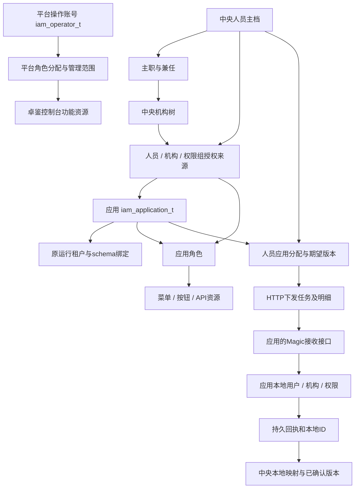
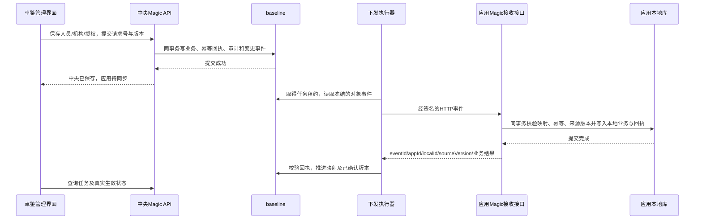

# 卓鉴统一身份管理平台整体设计 V3（已确认）

日期：2026-09-28。工程：`data-elements-idaas`；复用后端：`data-elements`；IAM 业务库：`baseline`。

**文档状态：用户已确认整体方案并授权全部阶段实施。完整目标 DDL 的 40 张中央业务表已经部署；公安、广电、海渔、澄天现均为独立 LOCAL 账号。历史只读核查中的数量对应设计时点，当前数据库扩展、功能和实际验收以 [后续阶段实施与验收](../后续阶段实施20260929/实施与验收说明.md) 为准；失败或未完成的验收记录不计作通过。**

## 1. 命名和本次设计结论

IAM 是 **Identity and Access Management**，中文为“身份与访问管理”。Identity 负责“这个人或机器是谁”，Access 负责“允许访问哪个应用及其中哪些功能”。`iam_` 用作卓鉴统一身份管理平台自身业务表的统一前缀。名称依据可参见 [NIST 的 IAM 术语说明](https://csrc.nist.gov/glossary/term/identity_and_access_management)。工程名仍为 `data-elements-idaas`，产品名“卓鉴”，系统名“统一身份管理平台”。

接受用户对应用的新定义：**一个原行业租户，在卓鉴中对应一个业务应用**。公安、广电、海渔、澄天都进入“应用管理”。业务使用者不再维护含义重复的应用目录和租户目录。原租户继续作为共享框架内部的数据库路由与行业配置标识。

目标分为三个层面：

| 层面 | 目标 |
| --- | --- |
| 卓鉴业务层 | `iam_application_t` 统一应用；中央人员、机构、角色、授权、下发、平台操作账号全部使用 `iam_` |
| 共享框架层 | `sym_tenant_t`、`api_file_t`、`ui_component_t`、公共配置等继续服务整个工程；行业 schema 绑定按已有配置解析 |
| 应用本地层 | 公安等库保留各自 `rm_user_t`、机构、角色和菜单闭环；本地账号与卓鉴操作账号隔离 |

“控制库 rm_ 整合进 iam_”是目标语义重构，不能只对旧表执行重命名。最终控制库不再保留承担活跃业务的 `rm_user_t` 和 `rm_user_tenant_rela_t`；其他应用尚未完成本地账号迁移时，这两张表暂作兼容，卓鉴新功能不再依赖它们。

## 2. 当前真实情况和影响

本轮以只读事务查询 MySQL 8.0.30 的真实表结构、记录数量及 Magic 引用。完整证据在 [现状核查](现状核查.json) 和 [补充核查](现状补充核查.json)。数量是核查时快照，不能当作将来的固定业务限制。

| 当前对象 | 核查结果 | 对方案的影响 |
| --- | --- | --- |
| 控制库 `rm_user_t` | 48 行，36 行未删除且启用，其余 12 行已删除 | 不能全量转成平台操作账号 |
| 控制库 `rm_user_tenant_rela_t` | 15 行；有效关系公安5、广电2、海渔1、澄天2 | 仍有旧系统依赖，不能立即改名删除 |
| 控制库现有 `iam_` | 9 张；中央人员5、中央机构113、操作权限5条归属于1个操作账号 | 可保留已有中央目录与操作者资格，但结构需要重整 |
| 历史身份操作 | 11 条；认证事件35条 | 要保留历史，不能将旧跨库操作自动重试成新下发 |
| 接收配置与任务 | 接收配置1条，任务及明细均0条 | 接收配置需重新验证；当前实际下发仍暂停 |
| 控制库机构、角色、菜单 | 没有 `rm_org_t`、`rm_role_t`、`rm_menu_t` | 平台自身权限不能继续借用公安表，需要中央新结构 |
| 公安实际库 | `baseline_ga_old`，已完成 LOCAL 账号闭环 | 本轮设计不改变其已有表或登录行为 |
| 其他行业应用 | 广电、海渔、澄天仍为 CONTROL 账号来源 | 独立迁移完成前继续原共享账号分支 |

另发现控制库公安 `json_config.schema` 仍记录 `baseline_ga`，但已验证的实际运行绑定是 `baseline_ga_old`。这属于元数据提示和有效路由配置不一致。实施应用绑定时要核对现有注册表与 Nacos 的有效数据源，把正确的绑定关系记录在审计中；不能按这个旧 JSON 值自动切库。本次未修正该配置。

当前源码 `workspace.ts` 仍要求平台会话必须含 `tenantId`，目录主要放在 `record_json` 中，平台 bootstrap 主要返回人员和机构。这些实现不能直接承载新的“全平台多应用工作区”，需要与后端一并调整，不能只改表名。

## 3. 应用、运行租户与身份主体

### 3.1 原租户如何成为应用

现有四个行业应用的 IAM 主键直接沿用原 `sym_tenant_t.tid`，减少历史引用转换。下面的名称为建议展示名称，原编码保持稳定：

| 原行业租户 | 新业务应用 | 保留的应用ID | 运行绑定 |
| --- | --- | --- | --- |
| 公安行业场景 | 公安元数据管理平台 | `2084109831682699264` | 原公安运行租户 → 实际 `baseline_ga_old` |
| 广电行业场景 | 广电数据管理平台 | `2084109831682699265` | 原广电运行租户 → 已有广电数据源 |
| 海渔行业场景 | 海渔数据管理平台 | `2084109831682699266` | 原海渔运行租户 → 部署时核验有效数据源 |
| 澄天数据中台 | 澄天数据中台 | `2084109831682699267` | 原澄天运行租户 → 已有澄天数据源 |

`iam_application_runtime_t` 保存 `app_id ↔ runtime_tenant_id` 的一对一绑定，不复制一份数据库密码和 schema 配置。`iam_application_t` 是 IAM 应用业务信息的唯一入口，原 `sym_tenant_t` 是共享框架的运行登记；不是两套供用户重复维护的业务目录。

IAM 应用状态表示是否接受中央授权、认证接入和下发；底层租户运行状态表示该业务系统是否运行。二者不能无条件联动。比如关闭卓鉴对公安的统一管理，不应导致已自闭环的公安本地系统无法登录。

应用内的 PC、手机和机器接口属于 `iam_auth_client_t`，一个应用可以有多个客户端。当前本地角色/菜单常用的 `app_id=1995678661281710081` 属于原本地产品上下文，**不能全局替换为新的 IAM 行业应用 ID**；由运行绑定中的 `local_permission_app_id` 明确记录映射。

公安库 `sym_application_t` 中的数据盘点“业务系统”是资产目录，不自动变成卓鉴的行业应用。后续若有某个被盘点系统确实需要独立身份接入，另作接入登记，不按资产表全量生成。

卓鉴自身的平台角色与资源也需要归属容器。建议登记一条固定的 `kind=INTERNAL` 应用用于卓鉴自己的权限，它不绑定行业 schema、不出现在业务应用列表、不接收普通人员应用授权。这是内部权限归属，不增加一个用户要维护的行业场景。

### 3.2 三类记录的边界

| 对象 | 目标表 | 用途 | 登录资格 |
| --- | --- | --- | --- |
| 卓鉴操作账号 | `baseline.iam_operator_t` | 操作管理控制台，维护中央资料和应用配置 | 只能建立卓鉴管理会话 |
| 中央人员主档 | `baseline.iam_subject_t` | 被集中管理的人员和任职、分配对象 | 默认无平台登录凭据 |
| 应用本地账号 | 如 `baseline_ga_old.rm_user_t` | 公安等应用的实际业务身份 | 由所属应用本地认证 |

中央人员可以分配到多个应用，各应用都有独立本地账号 ID、密码和角色。平台操作账号可以可选关联一份人员档案，但不能因这个关联自动取得该人员的业务应用权限；也不能因某人被中央管理就自动给他卓鉴操作权限。

统一认证账号 `iam_auth_account_t` 作为后续可选能力单列，用于公众登录或明确接入的统一认证，不与操作账号混用。用户当前要求的两套账号隔离适用于先行阶段；**是否进一步开通集中认证/SSO，需要在该阶段单独明确，不能因登记应用就默认开放**。初始各业务应用 `auth_mode=LOCAL`、`provisioning_mode=OFF`。

身份域 `workforce/public` 区分政企与公众数据，并非行业租户。行业应用在 `identity_domains` 明确支持哪些域；中央机构、人员、角色和授权按域校验。

## 4. 数据库总体结构

完整目标结构为 **40 张中央表**，其中包含对现有 9 张 IAM 表的复用、重构和归档替代。它们按5个能力阶段逐步建立，第6阶段退役旧共享账号依赖；不是第一步一次建40张，也不将这些表放入公安等业务库。

| 能力组 | 表名 | 主要关系 |
| --- | --- | --- |
| 应用目录 | `iam_application_group_t`、`iam_application_t`、`iam_application_runtime_t` | 分组→应用→原运行租户 |
| 平台操作权限 | `iam_operator_t`、`iam_operator_role_rela_t`、`iam_operator_scope_t` | 操作账号→内部角色→该角色分配的管理范围 |
| 角色资源 | `iam_role_t`、`iam_resource_t`、`iam_role_resource_rela_t` | 应用→角色→菜单/按钮/API资源 |
| 中央人员机构 | `iam_subject_t`、`iam_org_t`、`iam_appointment_t` | 人员↔主职/兼任↔机构树 |
| 字典与扩展 | `iam_dict_item_t`、`iam_field_definition_t` | 条线、岗位等定义；资料扩展schema |
| 应用分配 | `iam_subject_app_t`、`iam_app_org_t` | 哪些人员和机构需要提供给哪些应用 |
| 授权来源 | `iam_access_grant_t`、`iam_grant_role_rela_t`、`iam_permission_group_t`、`iam_group_member_t` | 人员/机构/权限组/机器主体→应用角色 |
| HTTP下发 | `iam_sync_config_t`、`iam_sync_task_t`、`iam_sync_item_t`、`iam_sync_attempt_t` | 地址配置→任务→对象事件→每次尝试 |
| 变更与映射 | `iam_change_event_t`、`iam_external_link_t` | 同事务事件驱动重算；中央ID↔本地ID |
| 平台共用能力 | `iam_credential_t`、`iam_account_security_t`、`iam_setting_t`、`iam_audit_event_t`、`iam_request_receipt_t`、`iam_migration_map_t` | 凭据、策略、安全状态、审计、幂等及迁移证据 |
| 可选统一认证 | `iam_auth_account_t`、`iam_auth_client_t`、`iam_auth_redirect_t`、`iam_auth_session_t` | 被管理人员的认证账号→客户端→认证会话；与操作账号隔离 |
| 公众身份 | `iam_public_profile_t`、`iam_legal_entity_t`、`iam_legal_member_t`、`iam_verification_t` | 自然人实名↔法人/经办关系↔核验记录 |

逐表字段、类型、默认值、索引、逻辑引用和业务约束见 [数据库表结构设计](数据库表结构设计.md)，对应 [目标 DDL 草案](目标表结构.mysql.sql)。DDL 没有执行，也不是现有表的原地改造脚本。

主要业务关系如下：

## 5. 授权、分配与同步的关联规则

### 5.1 中央资料不隐含登录权限

新增人员只是建立档案。将档案分配到公安，仅说明公安需要接收该人员的资料。是否具备应用访问资格，由有效授权决定；本地账号是否已有密码、是否被本地停用、是否具有实际角色，仍由接收系统确认。界面分别显示“中央分配”“待下发”“已确认”“冲突”，不能将中央保存成功当成应用账号已经可用。

`iam_subject_app_t` 的 `DIRECTORY_ONLY` 模式用于仅提供目录资料，默认不赋予访问资格。`GRANT_DERIVED` 模式下，它是授权计算结果和下发状态的投影；真实权限仍从有效授权来源计算，不能允许任意接口直接改投影绕开授权。

人工目录分配来源通过 `directory_assigned` 单独保留。人员同时具有人工分配和授权来源时，撤销最后一个授权后仍保留目录同步，但撤销中央授予的访问资格；仅由授权产生且没有其他来源的分配改为REVOKED，保留本地撤销确认记录，不直接删除映射。这样不会因某一种来源撤销而丢掉其他来源。

机构有两种不同关系：`iam_app_org_t` 确定某应用接收哪些机构资料；机构类型的 `iam_access_grant_t` 确定该机构哪些人员获得应用访问资格。接收了某机构不代表该机构所有人自动获权。

### 5.2 访问资格与权限计算

先校验人员、应用、身份域、授权状态及时间窗口，再按来源计算：人员直接授权 + 当前有效任职机构授权（按规则包含下级）+ 当前有效权限组成员授权。各有效来源提供的角色取并集，只有启用的同应用角色和资源参与结果。保留每一项授权来源，撤销某个来源不会删除其他来源仍然授予的相同角色。

平台操作权限单独计算：**某一角色分配拥有所需功能码，并且同一角色分配的范围包含目标对象，才允许该动作。** 不能把“角色A可编辑公安”与“角色B只读全部应用”组合成“可编辑全部应用”。没有默认超级管理员布尔字段，也不按账号名称或角色显示名越权。

范围按动作作用于不同对象，不能拿应用范围冒充中央主档的编辑范围：

| 管理范围 | 可用于授权的操作 | 额外限制 |
| --- | --- | --- |
| APPLICATION | 该应用的配置、角色、资源、人员分配及应用内账号别名 | 不因此获得中央人员姓名、联系方式、任职和机构树的修改权；只读也只返回该应用可见对象的必要字段 |
| ORG | 范围内中央人员、任职和机构资料 | 移树与调岗同时检查来源、目标及受影响对象；含app_id时只允许该机构在指定应用内的分配和授权动作 |
| ALL | 已授予身份域内的对应功能 | ALL只是对象范围，仍需该角色分配具有功能权限；不等于自动取得所有管理功能 |

授予平台角色、管理范围或业务应用角色还需专门授权管理功能，以及可授出的权限上限；不能通过编辑自己角色或给别人转授超出范围的权限绕过限制。跨域范围逐项登记。初次迁移先等价还原现有5条权限；新增应用管理、平台账号和角色管理等功能的初始授权清单，在第1阶段实施前单列确认，不能将现有1个操作账号直接推定为全权限账号。停用或撤销最后一个有效授权管理入口前要校验恢复路径。

可授出的上限直接从操作者当前有效角色分配计算，不再维护另一套角色清单：授予平台角色时，其每个功能和拟授出的每个范围必须被操作者有权转授的功能与范围覆盖；业务应用角色的转授限于有授权管理功能的指定应用和对象范围。修改一个已被分配的平台角色，还必须核对该角色所有既有分配的影响，不能通过修改角色定义间接扩大其他人的权限。

CLIENT类型授权仅给机器身份调用API，不能继承人的控制台会话或菜单权限。某客户端属于应用A，并不自动获得应用B的API权限；跨应用调用必须显式授予B的API角色，并校验令牌的目标应用。平台内部角色仅关联操作账号；普通人员的应用授权接口拒绝 `kind=INTERNAL` 应用。

授权过期在鉴权时直接判断，不能依赖每天定时任务才失效。时间任务负责重算下发目标、生成变更和清理缓存；对独立应用的撤销属于异步传播，界面显示待确认直到接收方提交，不承诺远端立即失效。

### 5.3 HTTP下发而非中央直接切库写入

沿用用户已确定的方式：应用实现卓鉴约定的标准接收接口，并在卓鉴填写地址和服务认证配置。应用接收业务写在 Magic API，卓鉴不通过应用的数据库连接直接增删本地用户。

新协议建议明确版本 `IDAAS/2`，对外使用 `targetAppId`，替换历史的 `targetTenantId` 业务称呼。旧 `IDAAS/1` 如需兼容，必须经显式版本适配，不能直接改字段却继续使用旧签名串。接收密钥固定绑定应用与接收实例；框架根据已验证的绑定解析本地运行租户，而不是接受请求体提供 schema。密码、平台令牌和平台操作者凭据不在人员资料里下发。

创建机构先于下级机构，机构先于任职用户，角色和资源先于关联授权；停用和撤销按依赖处理。网络超时保留原事件ID和原报文重试，不重复开户。HTTP 200不代表业务成功；必须核对协议、目标应用、实例、对象、事件号、版本和结果。回执若落后于当前期望版本，仍保持待同步；`STALE` 只有在远端状态核验兼容后才能计为已收敛，不能盲目当作成功。

同一个人员被分配到多个应用时，各应用有各自的期望版本。授权改变而人员基本资料不变，也必须生成新版本，不能只用人员主档version阻止新的撤权事件。中央业务和变更事件同库事务，远程HTTP只在事务提交后执行；不尝试跨schema分布式事务。

任务保存非秘密配置快照，并记录每次使用的服务凭据版本。执行时仍检查最新的接入开关和目标地址许可；接收地址、实例或字段映射发生改变后，旧任务暂停并重新预览，不能把已确认的旧任务静默改投其他接收方。凭据轮换不改变事件内容和事件号。接收实例变更时重新核验本地映射，不继承上一个实例的已确认状态。

已有本地用户不按同名、手机号或相同ID自动合并。接收方明确同意关联后，保存稳定映射。中央来源和本地来源的资料、角色与停用状态分别处理：中央撤权只能撤销其拥有的来源关系；中央重新启用不能清除本地停用；本地保持可独立维护。关闭接入先停止任务，显式脱管后才移交资料维护责任。

后续接收方可以用原基础表加轻量来源映射和幂等回执支持上述规则；必须保留来源区分，不能只凭中央表记账就声称远端幂等。具体采用少量字段还是两张轻量接入表，在批准接入该应用时单独审查。本次40张表全部属于控制库，DDL不含任何应用本地库改动。

## 6. 功能设计及后端分工

完整菜单、功能、关联对象、接口分组和验收条件见 [功能与关联设计](功能与关联设计.md)。现有32个导航项都已映射到目标功能，不因暂未实现就删除导航，也不将前端种子或静态页当成后端完成。

平台登录改为校验 `iam_operator_t` 及其独立凭据、角色与范围，返回平台会话。平台工作区不再要求 `tenantId`；`currentAppId` 仅为选中的应用筛选条件，不是登录身份或直接数据库路由权。前端按接口分页加载目录和应用，不一次 bootstrap 返回全库人员。

接口统一放在 **`13.统一身份管理`**，按认证会话、应用、人员机构、授权、同步、平台权限、配置、审计和公众身份编号分组。用户/机构/应用 CRUD、引用校验、授权并集、版本检查、状态机、任务编排及接收业务均由 Magic API 承担。

Java 框架负责数据库/事务边界、平台与本地会话隔离、密码及密钥组件、受控HTTP传输与签名、后台调度执行原语、将Magic返回的权限规则应用到实际接口，以及未来认证协议的框架实现。协议验签和令牌生成不在业务脚本里自行拼装；业务规则仍可在 Magic 查看修改。没有新增独立后端工程。

可选 OIDC/OAuth 接入应使用成熟协议实现并遵循授权码、PKCE、精确回调地址和令牌保护要求；不把任意平台token转换成应用会话。相关安全基线参见 [RFC 9700](https://www.rfc-editor.org/rfc/rfc9700.html)。本项目的用户机构HTTP下发标准是自定义协议；可在后续设计 SCIM 适配，但不宣称当前标准已经实现 [SCIM 协议](https://www.rfc-editor.org/rfc/rfc7644.html)。

## 7. 现有表如何整合

| 当前表或对象 | 目标 | 迁移注意事项 |
| --- | --- | --- |
| `baseline.rm_user_t` | 明确的平台操作者 → `iam_operator_t` + `iam_credential_t`；被管理人员按映射进入 `iam_subject_t`；其他旧应用账号先保留兼容 | 不复制48条就全员获得平台登录；现有1个具备操作权限的账号是核对起点。旧账号是否作为档案、操作者或两者，需要逐条分类 |
| `baseline.rm_user_tenant_rela_t` | 确认的人员归属 → `iam_subject_app_t`；实际权限另核对为授权；旧应用成员关系待本地迁移后退役 | user_id所指主体已经变化，不能直接改名成新关系。成员关系本身不能生成全部角色权限 |
| `iam_subject_t` | 同名表结构化重建/演进 | 拆出姓名、状态、联系方式等列；appointments进任职表；密码/锁定/verified等不同语义分别迁出或标记历史来源 |
| `iam_directory_org_t` | `iam_org_t` | 保留113个已存在中央机构ID与层级；编码冲突显式处理，不能把不同应用机构按名称合并 |
| `iam_operator_permission_t` | 内部角色、资源、账号角色分配及管理范围 | 将5条直接权限及目标范围逐条核对为等价权限，不扩大授权范围 |
| `iam_account_security_t` | 同名表按认证主体类型重构 | 旧user_id关联改为明确OPERATOR，不与公众/统一认证锁定状态串用 |
| `iam_auth_event_t` | `iam_audit_event_t` 中AUTH事件 | 保留原发生时间、结果和主体引用；未知/旧主体用LEGACY引用，不补造登录账号 |
| `iam_identity_operation_t` | `iam_request_receipt_t` 的历史归档或独立归档文件 | 11条旧跨库过程不能自动恢复执行；保存旧状态和安全资料摘要及原始私有备份 |
| `iam_receiver_config_t` | `iam_sync_config_t` + `iam_credential_t` | 目标租户映射应用，密钥由框架受控迁移，新配置默认关闭，重新校验地址和接收实例 |
| `iam_provision_task_t`、`iam_provision_item_t` | `iam_sync_task_t`、`iam_sync_item_t`，并增加attempt记录 | 当前均0条，仍保留完整备份。未来重试、部分失败和版本按新状态机实现 |
| `sym_tenant_t` | 保留共享运行登记，建立应用绑定 | 不改原租户ID、不直接批量重写业务库tenant_id |
| `api_file_t`、`ui_component_t`及框架共用表 | 保留原职责 | 它们不因卓鉴重构而全部改成iam前缀 |
| 各业务库 `rm_*`、`sym_application_t` | 保留所属应用业务语义 | 本次不是业务库表前缀改造 |

迁移前按类型归档所有旧字段，不能因为目标列少就丢失 `rm_user_t` 里的历史资料。关键字段进入确定列，其余经分类进入相应 `ext_json` 或只读归档；凭据、临时状态、权限字段不得塞入普通资料JSON。每次迁移写 `iam_migration_map_t`，记录来源、目标ID和摘要。

现有36个活动共享账号与中央5个人员档案并非数量相同的一组对象；没有明确关系的账号保持迁移待分类，不按用户名/电话强制合并。迁移中复制旧密码摘要只限于确认的对应登录账号，并标记旧算法；不将平台密码作为下发资料。

## 8. 落地阶段和验收门槛

| 阶段 | 范围 | 可以确认的完成条件 |
| --- | --- | --- |
| 1：平台自身底座 | 15张目标表；独立操作账号、平台功能角色与范围、四个应用登记及运行绑定、基础策略/凭据/审计/幂等/迁移映射 | 卓鉴登录和平台管理不再查询控制库rm账号；四个行业应用可正确显示；公安原闭环及其他旧系统登录回归通过 |
| 2：中央目录 | 7张表；人员、机构、主兼任、岗位条线字典、扩展字段、应用人员与机构范围 | 原5人员/113机构完整迁入；增删改、移机构、主职唯一和跨域约束通过；应用分配状态不伪装成本地生效 |
| 3：应用授权 | 5张表；业务角色资源、用户/机构/权限组授权、有效期与来源解释、客户端登记 | 同应用引用校验、并集与撤权、到期、跨域隔离通过；平台内部角色无法授给业务人员；客户端登记不表示协议已可用 |
| 4：HTTP下发闭环 | 6张中央表；配置、任务、事件、重试、映射、对账；经后续批准后接入一个应用的Magic接收端 | 真正通过HTTP写入目标；重复/乱序/超时/部分失败/撤权/脱管测试通过；应用断开中央仍可本地维护 |
| 5：统一认证和公众能力 | 7张表及之前预留的客户端/凭据能力；自然人、法人、经办、可选统一认证、MFA、回调、会话与API执行策略 | 外部实名服务和认证协议实际联调后才开放相应状态；与平台操作账号隔离；本阶段统一认证需独立确认 |
| 6：旧共享模型退役 | 广电、海渔、澄天按应用逐个完成本地账号闭环；清理控制库rm依赖 | 所有消费者、定时任务、Java映射和Magic查询已迁移；其他系统通过回归；历史归档可恢复后，控制库不再有活跃rm表 |

第6阶段可与第2—5阶段并行排期，但依赖相关应用迁移安排，不能为了“控制库表名整齐”提前切断旧系统账号。第1阶段已实施；下一阶段为中央目录，完整40表不会一次投入使用。

表定义中引用后续阶段的可选字段先保持空，相应操作按能力状态关闭。例如第1阶段尚无中央机构新结构时，不开放ORG管理范围；阶段2/3尚未下发时，不查询阶段4的任务和变更表。阶段4接入前生成一次完整目录和授权基线，再启用持续变更事件。第1阶段平台登录继续使用已有独立认证框架的会话存储及安全版本校验，不等待第5阶段的统一认证会话索引。

实施各阶段都先生成备份、字段映射、只读预检、差异清单和恢复步骤；采用新表准备→核对→切换单一权威写入→回归的过程。避免无期限双写两套账号；切换后回滚必须先冻结写入并处理新增数据，不能只把旧表覆盖回来。旧表何时归档/删除列入阶段验收动作。

## 9. 本次需要确认的设计内容

本次建议确认的基础方向是：

1. 卓鉴业务中的应用等于原行业租户；当前四个行业一对一，沿用旧租户ID为IAM应用ID，保留底层运行租户。
2. 控制库平台登录账号采用 `iam_operator_t`，中央被管理人员采用 `iam_subject_t`，应用本地账号继续属于各自业务库，三种记录不混用。
3. 所有新平台业务归入 `iam_` 与 `13.统一身份管理`；控制库旧rm表按实际依赖逐步退役，其他应用尚未迁移时先留兼容。
4. 中央档案、应用授权和HTTP下发分清事实与结果；本地密码、停用状态和本地来源权限不被中央资料同步覆盖。
5. 长期40表按上述阶段落地，先做第1阶段的独立平台底座。第5阶段的统一认证是预留扩展，不默认为所有应用开启SSO。

最初设计提交只新增文档及评审入口；该次离线结果见 [设计校验记录](设计校验记录.json)，保留为设计提交记录。后续第一阶段已实际迁移、发布、编译及验收，证据在 [第一阶段实施与验收](../第一阶段实施20260928/实施与验收说明.md)，设计离线核对不能代替实际功能验收或证明后续阶段完成。
