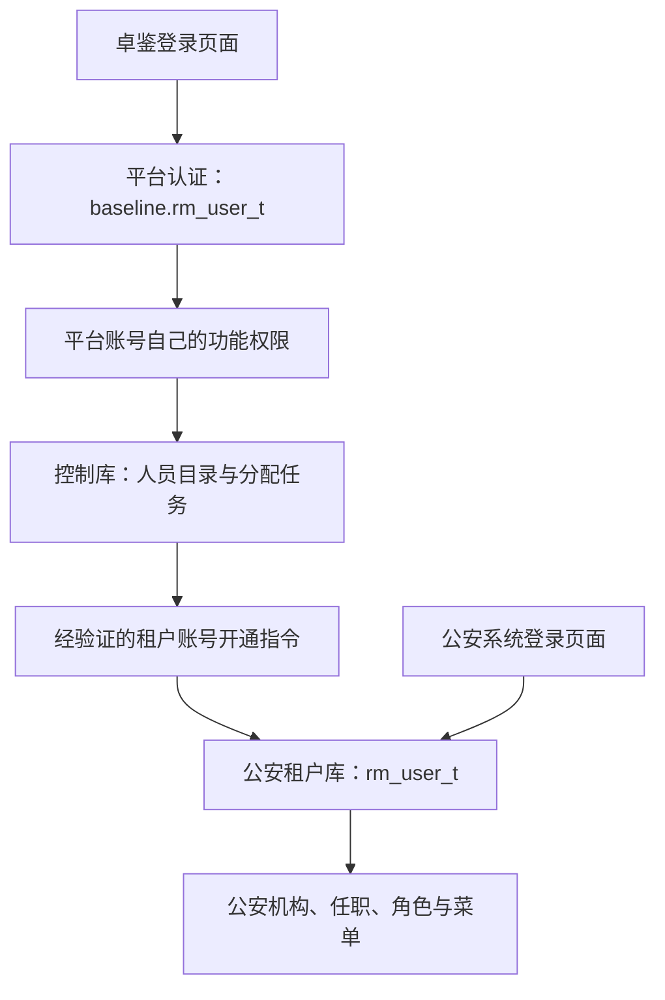

# 卓鉴统一身份管理平台：第二阶段架构调整与落地计划

> 后续安排已更新：2026-09-28 用户要求先恢复原租户系统，只开发卓鉴。租户独立账号及接收结构已回退，原共享账号模型恢复。本文是历史设计，当前范围和顺序以 [租户改造回退与平台优先开发说明](租户改造回退与平台优先开发说明.md) 为准。

日期：2026-09-28。工程：`data-elements-idaas`，共享后端：`data-elements`。控制库：`baseline`，公安租户库：`baseline_ga_old`。

状态：本文保留第二阶段调整时的设计依据。2026-09-28 已进一步完成公安独立账号基础与中央 HTTP 用户机构下发，当前实际结构、接口和剩余工作以 [第二阶段接口下发实施说明](第二阶段接口下发实施说明.md) 为准；[接收标准](IDAAS-1用户机构下发接口标准.md) 明确取代本文第6节直接切库执行的早期建议。第一阶段历史表尚未删除。

## 1. 用户已经明确的边界

控制库和租户库始终存在。控制库的登录账号只用于卓鉴统一身份管理平台；租户库的登录账号只用于所属租户系统。平台操作账号和平台 token 都不能直接登录租户。没有卓鉴产品入口时，租户仍能通过共享 `data-elements` 后端完成本租户基础管理。

这里“独立”首先是账号、凭据、会话及权限隔离，并不要求本阶段将整个共享后端改成控制库不可用时仍可启动。库故障容灾与不启用卓鉴界面是不同要求。

推荐采用 **平台登录账号与租户登录账号两套认证体系**。卓鉴管理的人员档案是业务数据，不能默认变成有权登录卓鉴的操作账号。

## 2. 必须分开的三类记录

| 记录 | 位置 | 作用 | 是否有登录凭据 |
| --- | --- | --- | --- |
| 平台操作账号 | `baseline.rm_user_t` | 登录卓鉴、维护人员目录和下发任务 | 有，仅用于平台认证 |
| 统一管理的人员档案 | 控制库，建议 `iam_subject_t` | 卓鉴所管理的人、来源、资料及分配目标 | 默认没有平台登录凭据，是业务档案 |
| 租户业务账号 | 租户 `rm_user_t`，公安库当前需要新增 | 登录公安等租户系统、承担本地角色权限 | 有，仅用于本租户认证 |

这仍是两套登录体系，人员目录不是第三套登录入口。平台账号“张三”和被管理人员“张三”可以关联或是不同人；不能因为名字、手机号或 ID 恰好相同就共享登录资格。

平台认证会话与租户业务会话之间没有自动转换箭头。中央可以通过授权管理任务开通、调整租户账号，这不等于平台操作者取得租户登录身份。

## 3. 当前结构与改造量

只读核对实际结构和当前 Magic 源码确认：

- `baseline.rm_user_t` 目前承担共享账号；`rm_user_tenant_rela_t` 承担控制库成员关系。
- `baseline_ga_old` 没有 `rm_user_t`，已有 `rm_org_t`、`rm_user_org_rela_t`、`rm_role_t`、`rm_menu_t`、`rm_user_role_rela_t`、`rm_role_menu_rela_t`。
- 旧 `/portal/login` 查询 `baseline.rm_user_t`。旧用户列表、保存、删除及当前用户信息调用控制库账号模块。因此目前并不满足两套登录体系隔离。
- `IdentityAccountAdminService.save` 修改共享账号及成员，`ControlIdentityService.removeMembership` 在移除最后成员后软删除共享账号。这些业务不能继续用于新的租户本地用户管理。
- 第一阶段 8 张 IAM 表仍存在公安库，P1 的读写和事务依赖这些结构。
- `TenantProperties` 将 `rm_user_t` 按表名加入租户过滤忽略清单。新增同名租户表后，不能继续仅凭一个全局表名判断租户过滤；控制库账号与租户账号需要明确的数据源及认证上下文。
- Magic 与低代码资源、平台配置仍使用控制库。两库都会存在，因此本阶段继续复用共享后端和当前资源部署。

证据包括 `ControlIdentityService.java`、`IdentityAccountAdminService.java`、`IdentityDirectoryServiceImpl.java`、`TenantProperties.java`、`MagicApiDatabaseResourceConfiguration.java`，以及当前 `01.系统门户/用户登录.ms` 和 `09.系统管理/02.用户管理/`。

## 4. 目标分工

| 能力或数据 | 控制库/卓鉴 | 租户库/租户系统 |
| --- | --- | --- |
| 登录 | 仅校验平台操作账号 | 仅校验本租户账号 |
| 账号启停、密码、锁定 | 维护平台操作账号自己的状态 | 维护本地业务账号自己的状态 |
| 功能权限 | 平台管理功能与允许操作的目标范围 | 本应用角色、菜单、按钮及数据范围 |
| 大型人员目录、来源和复杂身份档案 | 集中保存 | 仅保存账号运行需要的基础资料 |
| 机构与任职 | 可登记统一目录或集中管理任务 | 原 `rm_org_t`、`rm_user_org_rela_t` 继续承担本地基础结构 |
| 下发及对账 | 保存分配、映射、任务、版本及结果 | 接收并维护基础账号和明确关系 |
| 业务资产 | 身份接入引用与策略 | `sym_application_t` 仍是业务应用资产主表 |
| 审计 | 集中管理与认证审计 | 本地登录和基础操作日志、接收回执 |

平台账号禁用只影响平台登录；它不会自动禁用同名租户业务账号。人员目录停用是否撤销其已下发租户账号，是独立、明确的人员生命周期动作。

## 5. 没有卓鉴时的租户自治

不启用卓鉴产品功能时，公安系统仍可：

1. 使用公安 `rm_user_t` 登录。
2. 新建、编辑、启停本地账号和设置本地凭据。
3. 维护本地机构、主职与兼任、角色、菜单及用户角色关系。
4. 查看本地基础日志及管理当前应用会话。

上述账号操作不在控制库新增平台操作账号，也不要求先创建卓鉴人员目录或控制库成员资格。控制库作为共享框架资源存在，不能因此成为本地账号的认证来源。

本地新建账号使用 `identity_origin=LOCAL`；接入卓鉴后可以显式把这个本地账号与某个人员档案关联。关联前验证身份和同名冲突，不根据名称或手机号自动合并。

先实现“本地管理”和“接入统一管理”两种业务配置。接入模式仍允许保留本地创建人员；来源决定哪些字段由中央管理、哪些字段可本地修改，不做两份完整 IAM。

## 6. 统一下发如何工作

中央下发的是“人员资料和租户账号开通/变更指令”，不是把平台操作账号及其密码复制到租户。

1. 在卓鉴维护人员档案，选择公安租户及需要的机构、岗位或明确角色。
2. 验证操作者功能权限、目标租户、引用机构/角色和执行方式。
3. 控制库保存人员到租户账号的映射及任务。候选结构为 `iam_identity_binding_t`、`iam_provision_task_t`，不能继续将平台操作账号当成控制库成员主体。
4. 执行器从已验证任务取得目标上下文，在公安库本地事务内创建/更新 `rm_user_t` 和明确的任职/角色关系，写持久回执。
5. 完成后更新中央结果；失败显示待处理并可重试。批量操作按人员记录状态。

幂等键包含目标租户和事件 ID，保存内容摘要与来源版本。重放返回同一结果；旧版本不能覆盖新版本；重复创建不能生成第二个本地账号。

账户开通和凭据激活分别表达。建议中央开通后先进入待激活状态，由本地授权操作或账号激活流程设置租户凭据；是否由统一平台代设一次性租户初始密码需要独立产品动作，不复用平台操作者密码，不把凭据写入通用任务资料。

下发不会自动下发全部平台操作账号，不自动关联全部租户，不替换用户的全部本地角色。中央撤销只处理明确的中央来源关系；本地来源关系保留，除非明确执行整个业务账号停用。

共享部署可通过已验证服务上下文执行本地事务，不必第一步引入消息中间件。未来跨部署接收接口使用单独服务认证，绑定注册目标；平台人的 token 不能冒充租户人的 token，也不能直接调用普通租户业务接口。

## 7. 隔离规则

| 边界 | 要求 |
| --- | --- |
| 登录查询 | 平台登录只读控制库账号，租户登录只读目标租户账号；没有错误密码后查另一个库的回退 |
| 登录名与密码 | 可出现相同登录名，但凭据独立，密码修改和失败锁定互不影响 |
| 会话 | 不同认证域/会话命名空间；平台 token 请求租户普通接口拒绝，租户 token 请求平台管理接口拒绝 |
| 用户 ID | 业务表继续使用本地账号 ID；中央人员 ID 通过映射关联，不能靠相同 ID 认定同一主体 |
| 权限 | 平台角色和租户角色分开计算，不把平台管理功能权限当作租户业务权限 |
| 租户隔离 | 本地账号唯一键、查询和关系都带可信租户，不能仅因已路由物理库而省略归属检查 |
| 来源 | 中央管理资料和中央来源状态由受信任任务更新；租户可维护本地字段及本地停用，不能用本地启用覆盖中央已执行的停用 |
| 撤销 | 中央目录撤销须执行到本地并撤销相应本地会话；任务失败显示未生效，不能保证异步下发立即完成 |

不增加特殊管理员布尔字段。平台管理功能、允许目标和本地用户管理权限依各自正常角色/资源及范围授权；人员的业务类型标签不承担授权。

关闭中央接入后，不自动删除已下发账号或悄悄把受中央管理字段变为本地权威。应执行明确脱管动作、记录映射及状态后，才转为本地管理。

## 8. 租户的轻量表结构预算

租户基础保留现有 6 张组织和权限表，新增必要的 **`rm_user_t`**。该表保存本地用户名、凭据、基本展示字段、启停与删除状态、登录失败限制、版本，以及少量中央来源映射字段。

候选映射字段为 `identity_origin`、`central_subject_id`、`source_version`、`source_enabled`；基本版本和本地状态分别管理。中央人员映射采用唯一约束，不根据展示名匹配；不同租户可有同名账号。准确字段、索引及类型在实施 DDL 中逐项列出。

来源状态不代替本地状态：中央来源停用与本地停用都可以阻止业务登录，重新启用必须满足对应来源要求。

另外保留 **1 张轻量事件/回执表**，建议名 `sys_identity_event_t`，记录接收、重放、版本、摘要、结果及必要基础操作事件。简单岗位、类型和版本字段并入已有 `rm_*`，不为每种基础属性单建 IAM 扩展表。

所以租户侧目标为：**补齐 1 张基础用户表，8 张 P1 IAM 表逐步收敛至 1 张轻量事件表和少量基础字段**。不是现在直接删除 8 张表。

## 9. 第一阶段结构的迁移方向

| 当前公安 IAM 表 | 目标 |
| --- | --- |
| `iam_user_profile_t` | 必需基础信息进入本地 `rm_user_t`，完整人员档案进入中央 `iam_subject_t`；保留租户专属字段归属 |
| `iam_appointment_ext_t` | 岗位等必要属性并入 `rm_user_org_rela_t`，保留关系 ID 和主/兼任 |
| `iam_org_ext_t` | 必需版本/属性并入 `rm_org_t`，复杂集中目录能力留中央 |
| `iam_application_t` | 控制库身份应用登记，继续引用租户 `sym_application_t` |
| `iam_role_ext_t` | 必需版本并入本地 `rm_role_t` |
| `iam_resource_ext_t` | 必需类型和版本并入本地 `rm_menu_t`，保留旧菜单枚举兼容 |
| `iam_audit_event_t` | 历史迁入中央集中审计，租户保留基础日志及事务内事件记录 |
| `iam_mutation_receipt_t` | 迁入/演进轻量 `sys_identity_event_t`，保留旧请求回执和重放语义 |

版本必须与相应本地业务写入处于同一事务，不能把版本移到控制库却仍声称租户写入原子。复杂中央配置用可恢复任务驱动本地结果。

控制库已有安全、认证和人员操作表可继续承担平台侧及历史记录，按认证域核对归属。人员目录、账号映射、任务及平台功能权限属于中央能力；按需增加中央结构，不下沉各租户。

控制库当前没有平台 `rm_role_t`、`rm_menu_t` 等基础角色资源表。本阶段需建立平台自己的功能权限来源，可以复用这套基础结构的模式或合适的中央授权表，不能再借用公安角色判断卓鉴平台权限。

## 10. 现有账号的安全迁移

1. 列出旧账号与实际租户关系，区分“平台操作账号候选”和“租户业务账号候选”，没有明确资格的不自动启用。
2. 有本地任职、角色等引用的人员迁入租户账号时尽量保留已有业务 ID，避免改写历史业务引用；中央人员 ID 另外明确映射。
3. 不全量复制控制库密码成为租户密码。准备独立租户凭据与激活步骤，至少一个具有本地维护功能权限的账号完成验证后才切换公安登录。
4. 控制库旧账号不会因为原来有公安成员关系而自动获得卓鉴操作权限；平台操作资格由平台自己的功能授权决定。
5. 改造旧 `/portal/login`、`/sym/user/*`、当前用户、审批选人和其他账号查询消费者，迁为读取本地账号；平台接口仅查询平台及人员目录。
6. 处理切换前旧会话：新业务接口只接受正确认证域与租户上下文，相关旧票据需要失效/重新登录，不能把旧控制库 token 继续当成本地认证。
7. 备份、预检、迁移核对、切换读写、回归、观察后才归档/退役旧 IAM 表及旧共享账号关系用途。

保留历史账号及审计不等于继续允许登录。未迁移的其他租户需要明确过渡配置和改造清单，不能仅完成公安就宣称所有租户已两套体系隔离。

## 11. 原计划未完成项及调整

| 项目 | P1 实际状态 | 新安排 |
| --- | --- | --- |
| 公安核心人员/任职/机构/应用角色资源/审计 | 已实现并验收，但账号是控制库共享来源 | 保留业务能力，迁为本地账号体系并回归 |
| 平台与租户独立账号、认证域、权限 | 未实现 | 2.1 优先建立，是新方向的基础 |
| 旧 `/sym/**` 写入口与版本统一 | 未完成 | 2.1 与本地账号改造一起完成 |
| 完整平台人员目录及跨租户分配 | P1 是单业务租户工作区 | 2.2 建中央人员目录、明确映射与管理范围 |
| 自动下发、重试和对账 | P1 只有原请求号人工恢复 | 2.2 建任务闭环 |
| 第二个真实租户写入隔离 | 未完成 | 2.3 接入第二租户并验证 |
| 认证客户端与 OIDC 单点登录 | 未完成 | 本阶段不做平台操作账号自动跨系统登录；业务人员 SSO 后续另定主体及授权 |
| 复杂授权并集、机构/组/期限、ORG/OWNER 委派 | 未完成 | 高级中央能力按需实施，基础角色权限先本地闭环 |
| MFA、公众身份、找回密码、外部目录 | 未完成 | 后续按独立业务需求选择 |

系统切换按钮继续作为导航，进入其他系统应使用其本地登录或已有本地会话。平台会话不会自动兑换成租户会话。

标准统一登录与目录下发是不同能力。未来若需要业务用户跨系统认证，需另行明确业务认证主体、明确账号绑定及目标应用资格；这不等于复用平台操作账号。OIDC 的职责是让应用验证认证服务提供的用户身份，SCIM 用于用户/组等目录资源管理。[OpenID Connect Core](https://openid.net/specs/openid-connect-core-1_0.html)，[SCIM RFC 7644](https://www.rfc-editor.org/rfc/rfc7644.html)。本阶段无需为下发实现完整协议服务端。

## 12. 建议阶段

第二阶段拆成三个可独立验收的子阶段，之后按需扩展。

| 阶段 | 工作 | 必须通过的验收 |
| --- | --- | --- |
| **2.1：两套账号隔离与基础自治** | 本地用户表、独立登录/会话/权限；平台登录改为平台功能权限；租户用户基础 CRUD；旧消费者和版本统一；IAM 基础属性收敛 | 平台账号/平台 token 不能进入租户；租户账号/token 不能进入卓鉴；同名不同密码互不影响；不启用卓鉴仍能本地开户、机构和角色管理 |
| **2.2：人员目录与统一下发** | 中央人员档案、目标映射、开通/更新/撤销任务、回执、失败重试；中央身份配置和审计收敛 | 人员档案本身不能登录卓鉴；下发不复制操作者账号/密码；重复、乱序、失败可恢复；本地来源数据不被清空；实际开通结果明确 |
| **2.3：多租户验证与迁移收尾** | 第二租户接入、基础批量分配及对账、来源管理、原 IAM 依赖切换与退役 | 两租户真实写入和登录隔离；撤销只影响目标；ID 和历史记录正确；旧表依赖清零后归档退役；其他系统入口分别认证 |
| **第 3 阶段：按需高级能力** | 细分管理范围、期限与多来源授权、MFA、外部目录、公众身份，或独立业务用户统一认证 | 每项独立验收，完整能力留中央，不要求租户安装整套 IAM |

2.1 首批交付包括精确 SQL/新增字段清单、认证隔离框架改动、Magic 用户接口及旧接口兼容、迁移/回退方案和真实边界验证。先保障隔离，再实施下发。

## 13. Magic API 与 Java 分工

业务继续优先在 Magic API：

- `13.统一身份管理`：平台账号、中央人员目录、目标映射、分配预检、任务受理/结果/重试与集中审计。
- `09.系统管理`：租户本地用户、机构、角色和菜单；保留既有调用路径，调整用户读写来源，不复用控制库账号 CRUD。
- 两边可共用输入校验和基础工具；不能共用一个隐式“用户来源”查询，让请求参数随意选择平台或租户账号库。

Java 必须改动的框架包括认证域与会话隔离、明确账号数据源、租户表过滤、平台管理任务的安全执行上下文、调度与清理。字段规则、SQL、状态推进、来源冲突和审计继续放在 Magic。平台管理令牌不能伪装成租户会话。

租户业务接口仍以 `tenantRuntime.id()` 作为归属依据。平台命令先核对权限和目标，再保存可信任务；执行器从任务恢复经过验证的上下文，异常后清理，拒绝默认数据库回退。

## 14. 本轮交付边界

本轮完成的是修正后的架构与阶段设计。数据库、运行接口及第一阶段 IAM 表仍保持当前发布状态。没有新增第二阶段用户表，没有复制凭据，没有删除表，也没有将系统切换改成平台账号自动登录。
