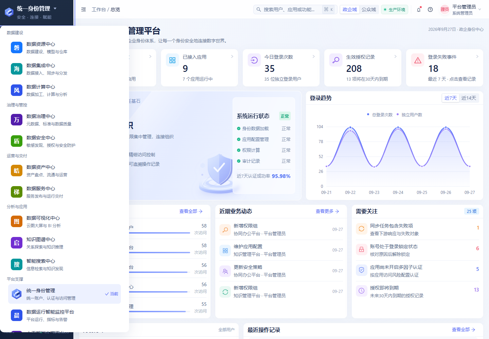

# 统一身份管理平台 · 系统切换接入说明

日期：2026-09-27。英文工程名：`data-elements-idaas`；中文产品名：卓鉴；系统名：统一身份管理平台。

后续调整：系统切换列表中的入口已补齐为“统一身份管理平台”，左上角按钮仍使用短名称“统一身份管理”；折叠侧栏二级菜单支持悬停、点击和键盘。最新行为及验收见 [折叠菜单与系统名称调整](折叠菜单与系统名称调整.md)。下文保留初次接入的验收记录和截图。

## 入口与分组

管理端左上角显示短名称“统一身份管理”与下箭头，保留卓鉴图形标识和“安全 · 连接 · 赋能”副标题。点击品牌区域即可打开系统切换菜单，键盘 Enter 同样可打开。侧栏折叠后保留图标入口，手机导航抽屉提供相同切换菜单。

菜单沿用万象、启智的五组分类：数据建设、治理与管控、运营与交付、分析与应用、平台支撑。卓鉴放在“平台支撑”的首项，与运行监控、人工智能支撑并列；列表标注当前系统。菜单在矮窗口和手机上限制高度并内部滚动，保证末尾入口可访问。完整品牌仍用于登录、页面标题、帮助、页脚和工程文档。

## 互通范围与地址

| 所属工程 | 切换菜单中的系统 | 开发地址 | 默认生产前缀 |
| --- | --- | --- | --- |
| data-elements-idaas | 统一身份管理平台 | http://localhost:3005/ | /idaas/ |
| data-elements-wanxiang | 数据资源中心（磐石）、数据治理中心（万象）、数据资产中心（皓月） | http://localhost:3010/ | /wanxiang-governance/ |
| data-elements-haitong | 数据集成中心（海通） | http://localhost:3002/ | /haitong/ |
| data-elements-qizhi | 数据计算、安全、服务、可视化、知识图谱、智能搜索、运行监控、人工智能支撑 | http://localhost:3001/ | /qizhi/ |

卓鉴菜单按实际归属打开这些中心的现有主页。万象治理切换器、万象内磐石/皓月使用的切换器、启智的公共切换器以及海通的切换器均增加“平台支撑 → 统一身份管理”。因此启智承载的各中心共享新增入口，不需要逐页复制切换组件。

澄天数据中台 `data-elements-chengtian` 的“全部导航”也增加“平台支撑 → 统一身份管理”。该入口来自共享后端控制库中的 `global-nav` 低代码组件，并非静态 Vue 菜单；当时使用的 `data/working/global-nav.vue` 工作副本不在当前 Git 树内。新增入口支持鼠标、Enter 和空格操作；抽屉高度扣除原有顶部 55px 偏移，避免矮窗口中末尾链接落在屏幕外。

各工程均可用 `VITE_IDAAS_CENTER_URL` 覆盖卓鉴部署地址；目标路由固定为 `#/console/workforce/overview`。卓鉴访问万象、启智和海通分别使用 `VITE_WANXIANG_GOVERNANCE_URL`、`VITE_QIZHI_CENTER_URL`、`VITE_HAITONG_CENTER_URL`。默认生产地址使用部署前缀，五个工程的生产构建均包含 `/idaas/`，不包含卓鉴开发来源 `localhost:3005`。生产环境的反向代理需要按实际部署提供相应前缀，本次没有执行生产部署。

## 会话与低代码发布

所有跳转使用当前标签页。导航不携带来源页面中的用户、令牌或密码，不更改租户选择及授权规则。目标系统执行现有登录校验；已有卓鉴会话时可以返回控制台，未登录时由原有逻辑进入登录页。本次实现系统导航互通，没有将卓鉴现有本地身份适配器改造成服务端跨系统单点登录。

数据中台的卓鉴导航地址单独维护，没有加入 `capabilityCenterBases` 的会话接收名单；现有跨来源会话桥的来源、窗口及 nonce 校验保持不变。导航回归额外确认 `http://localhost:3005` 不会从该桥取得数据中台令牌。

低代码变更先通过当前平台会话核对 `/sym/tenant/current`；发布会话解析到“公安行业场景”，租户 ID 为 `2084109831682699264`。修改对象是 `baseline` 控制面的共享 `global-nav` 组件，组件 ID 为 `2009111573765361664`，不写行业业务数据库。界面往返检查使用浏览器已有的行业上下文，未执行租户切换或业务数据写入。

每次发布均先回读并备份当前源码和编译产物，校验未发生并发修改，再通过 `saveCode` 同时保存源码、编译 JS 和 CSS，调用组件缓存刷新，并回读逐一比对。最终三项均通过。备份和过程日志保存在本机临时目录 `data-elements-idaas-switch-20260927`，没有改写历史验收文件。

## 验收结果

| 检查 | 结果 |
| --- | --- |
| 卓鉴文字令牌、源码语法、UI 和字号静态审计 | 通过；UI 4326/4326，字号契约 27/27 |
| 卓鉴单元测试 | 90/90 通过，包含开发/生产地址与独立部署覆盖验证 |
| 卓鉴 TypeScript 与生产构建 | 通过 |
| 新增切换浏览器测试 | 17/17 通过 |
| 原有紧凑布局及字号浏览器回归 | 36/36 通过 |
| 数据中台导航源码、实际编译点击处理器、地址与会话桥检查 | 73/73 通过 |
| 万象单元测试 | 258/258 通过 |
| 万象、启智、海通类型检查和生产构建 | 通过 |
| 数据中台生产构建 | 通过 |
| 数据中台共享低代码发布及缓存回读 | 源码、编译 JS、CSS 均通过 |

新增浏览器检查覆盖 1920、1440、1360×582 矮窗口、390px 手机和折叠侧栏。12 个外部中心的点击目标通过拦截导航请求核对归属、路由与当前标签页；替代响应不作为目标系统运行证据。

另外在真实应用中实际完成卓鉴 → 万象 → 卓鉴、卓鉴 → 启智 → 卓鉴、卓鉴 → 海通 → 卓鉴，以及数据中台“全部导航” → 卓鉴控制台。万象、启智、海通的新增菜单和目标页面均在实际浏览器中读取确认，数据中台的矮屏滚动和键盘跳转也已核对。

原有 36 项浏览器回归覆盖政企/公众全部工作区、认证入口、应用详情页签、抽屉、弹窗、宽表及长字段；前次调整的认证页 44px 输入框、48px 主按钮和 24px 字段间距继续通过。

构建仍有部分大分包、第三方注释和既有 eval 使用提示，均未阻断构建。本次没有更换依赖或修改这些业务实现。

当前验收日志见 `系统切换验收/`；真实 React 截图见 `系统切换截图/`。独立 HTML 辅助预览只同步短名称和样式，不作为系统导航或 React 验收证据。

